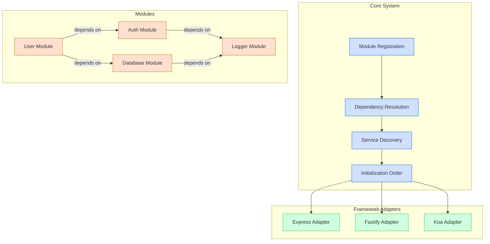
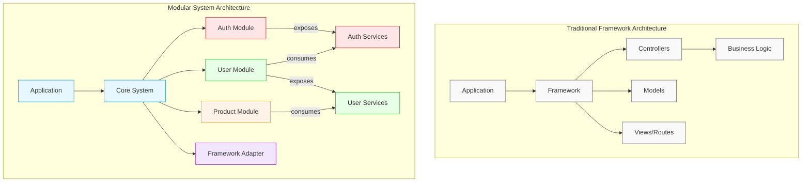
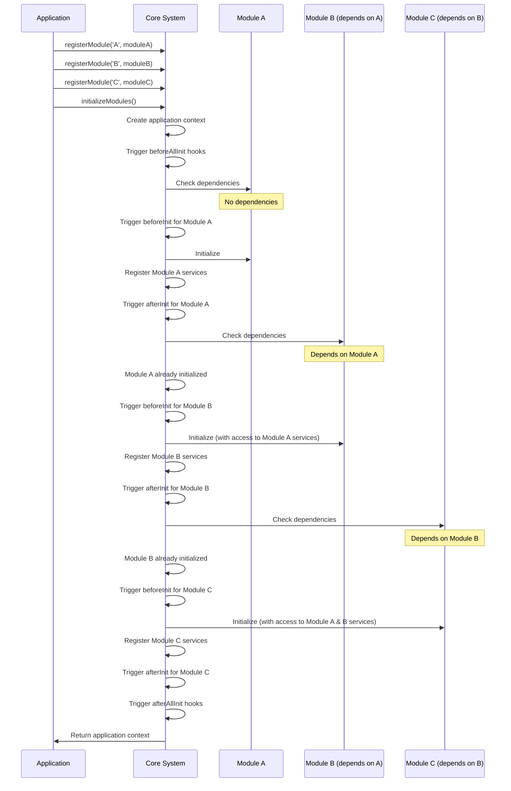

# Node.js Modular System

[](https://www.npmjs.com/package/@modular-system/core)
[](https://opensource.org/licenses/MIT)
[](https://github.com/stratpoint-engineering/nodejs-modular-system/actions)
[](CONTRIBUTING.md)

A flexible, framework-agnostic modular architecture for building maintainable Node.js applications.

## 📑 Table of Contents

- [Vision](#-vision)
- [Architecture Overview](#️-architecture-overview)
- [What Makes This Different From a Framework?](#-what-makes-this-different-from-a-framework)
- [Core Values](#-core-values)
- [Module Structure](#-module-structure)
- [Getting Started](#-getting-started)
- [Enterprise Features](#-enterprise-features)
- [Implementation Examples](#️-implementation-examples)
- [When to Use This System](#-when-to-use-this-system)
- [Migration Path](#-migration-path)
- [Community & Support](#-community--support)
- [License](#-license)

## 🌟 Vision

The Node.js Modular System provides a powerful organizational architecture that solves fundamental challenges in building maintainable applications without restricting your technical choices. It offers structure without sacrifice, allowing you to use any Node.js framework while keeping your business logic clean, modular, and reusable.

## 🏗️ Architecture Overview

The system consists of two main components:

1. **Core System**: Published on npm, providing the foundational infrastructure:
   - Module registration and lifecycle management
   - Dependency resolution between modules
   - Service discovery for inter-module communication
   - Initialization order management

2. **Independent Modules**: Self-contained pieces of functionality:
   - Written in TypeScript for type safety
   - Explicit dependencies on other modules
   - Framework-agnostic business logic
   - Easily portable between projects



## 🔍 What Makes This Different From a Framework?

### Organizational Structure, Not Technical Constraints

- **Frameworks** dictate how you handle routing, middleware, database access, and other technical aspects.
- **Our Modular System** focuses exclusively on solving organizational challenges—how code is structured, how modules communicate, and how dependencies are managed.

### Framework Independence

- **Frameworks** lock you into their ecosystem, making it difficult to switch.
- **Our Modular System** works with any Node.js framework (Express, Fastify, Koa, NestJS), allowing you to use the one you prefer or even switch frameworks with minimal changes.

### Composition Over Inheritance

- **Frameworks** often rely on inheritance patterns where components extend framework base classes.
- **Our Modular System** uses composition where independent modules expose services that other modules can consume.

### Explicit Dependencies

- **Frameworks** often use global registries that create hidden dependencies.
- **Our Modular System** requires modules to explicitly declare their dependencies, making the application's structure transparent.



## 🔑 Core Values

### 1. Module Registration and Lifecycle Management

**Benefits:**
- **Clear Boundaries:** Each module has explicit boundaries and a well-defined interface
- **Separation of Concerns:** Business logic is encapsulated within modules
- **Standardized Structure:** Consistent module structure makes the system easier to learn
- **Controlled Lifecycles:** Modules have defined initialization and shutdown phases

### 2. Dependency Resolution Between Modules

**Benefits:**
- **Explicit Dependencies:** Modules declare what they depend on
- **Reduced Hidden Coupling:** No mysterious connections between components
- **Testability:** Easier to mock dependencies for testing
- **Documentation by Code:** The dependency graph is visible in the code itself

### 3. Service Discovery

**Benefits:**
- **Clean Interfaces:** Modules interact through well-defined service interfaces
- **Implementation Hiding:** Internal module details remain private
- **Dependency Inversion:** High-level modules define interfaces that low-level modules implement
- **Runtime Flexibility:** Services can be replaced without changing consumer code

### 4. Initialization Order Management

**Benefits:**
- **Predictable Startup:** Modules initialize in the correct order based on dependencies
- **Error Isolation:** Failures during initialization are properly attributed
- **Asynchronous Support:** Handles async initialization gracefully
- **Runtime Verification:** Checks that all required modules are available at startup



## 📦 Module Structure

Each module is a self-contained unit with its own internal structure:

```
auth-module/
├── src/
│   ├── services/             # Core business logic
│   ├── repositories/         # Data access layer
│   ├── controllers/          # Request handlers
│   ├── middlewares/          # HTTP middlewares
│   ├── utils/                # Utility functions
│   ├── types.ts              # TypeScript interfaces
│   ├── routes.ts             # Route definitions
│   └── index.ts              # Module entry point
├── tests/                    # Tests for the module
├── package.json              # Module metadata
└── README.md                 # Module documentation
```

## 🚀 Getting Started

### Installation

```bash
# Install the core system
npm install @modular-system/core

# Install framework adapter
npm install @modular-system/express-adapter
# OR
npm install @modular-system/fastify-adapter

# Install pre-built modules
npm install @modular-system/auth
npm install @modular-system/database
```

### Alternative: Copy Modules Directly

For maximum flexibility, modules can be copied directly from other projects:

```bash
# Copy modules from another project
cp -r ../other-project/modules/auth ./modules/
```

### Complete Setup Example

Here's a step-by-step guide to setting up a new project:

1. **Create a new project**

```bash
mkdir my-modular-app
cd my-modular-app
npm init -y
```

2. **Install dependencies**

```bash
npm install @modular-system/core @modular-system/express-adapter express
npm install typescript @types/node @types/express --save-dev
```

3. **Create a basic TypeScript configuration**

```bash
npx tsc --init
```

Edit `tsconfig.json`:

```json
{
  "compilerOptions": {
    "target": "ES2020",
    "module": "NodeNext",
    "moduleResolution": "NodeNext",
    "esModuleInterop": true,
    "strict": true,
    "outDir": "dist",
    "declaration": true
  },
  "include": ["src/**/*"],
  "exclude": ["node_modules", "dist"]
}
```

4. **Create a simple module**

Create `src/modules/hello/index.ts`:

```typescript
const helloModule = {
  id: 'hello',
  name: 'Hello Module',

  dependencies: ['logger'],

  initialize(context) {
    const logger = context.getService('logger');
    logger.info('Hello module initialized');
  },

  routes(app) {
    app.get('/hello', (req, res) => {
      res.json({ message: 'Hello, world!' });
    });
  },

  services: {
    sayHello(name) {
      return `Hello, ${name}!`;
    }
  }
};

export default helloModule;
```

5. **Create the application entry point**

Create `src/app.ts`:

```typescript
import { createApp, registerModule, initializeModules } from '@modular-system/core';
import { createExpressAdapter } from '@modular-system/express-adapter';
import express from 'express';

// Import modules
import helloModule from './modules/hello';

// Simple logger module
const loggerModule = {
  id: 'logger',
  name: 'Logger Module',
  dependencies: [],
  initialize() {
    console.log('Logger module initialized');
  },
  services: {
    info: (message) => console.log(`[INFO] ${message}`),
    error: (message, error) => console.error(`[ERROR] ${message}`, error)
  }
};

async function startApp() {
  try {
    // Create Express app
    const expressApp = express();

    // Create application with Express adapter
    const app = createApp(createExpressAdapter(expressApp));

    // Register modules
    registerModule('logger', loggerModule);
    registerModule('hello', helloModule);

    // Initialize all modules
    const context = await initializeModules(app);

    // Start server
    const port = process.env.PORT || 3000;
    expressApp.listen(port, () => {
      console.log(`Server running on port ${port}`);
    });
  } catch (error) {
    console.error('Failed to start application:', error);
    process.exit(1);
  }
}

startApp();
```

6. **Add scripts to package.json**

```json
{
  "scripts": {
    "build": "tsc",
    "start": "node dist/app.js",
    "dev": "ts-node src/app.ts"
  }
}
```

7. **Run the application**

```bash
npm run dev
```

Visit http://localhost:3000/hello to see your first module in action!

### Basic Usage

```javascript
// app.js
import { createApp, registerModule, initializeModules } from '@modular-system/core';
import { createExpressAdapter } from '@modular-system/express-adapter';
import authModule from '@modular-system/auth';
import loggerModule from '@modular-system/logger';
import userModule from './modules/user'; // Your custom module

async function startApp() {
  // Create application with chosen framework adapter
  const app = createApp(createExpressAdapter());

  // Register modules
  registerModule('auth', authModule);
  registerModule('logger', loggerModule);
  registerModule('user', userModule);

  // Initialize all modules (handles dependency order)
  const context = await initializeModules(app);

  // Start server
  const port = process.env.PORT || 3000;
  app.listen(port, () => {
    console.log(`Server running on port ${port}`);
  });
}

startApp().catch(console.error);
```

### Creating a Custom Module

```javascript
// modules/product/index.js
const productModule = {
  id: 'product',
  name: 'Product Module',

  // Declare dependencies
  dependencies: ['logger', 'database'],

  // Initialize module
  initialize(context) {
    this.logger = context.getService('logger');
    this.db = context.getService('database');

    this.logger.info('Product module initialized');
  },

  // Register routes
  routes(app) {
    app.get('/api/products', this.getAllProducts.bind(this));
    app.get('/api/products/:id', this.getProductById.bind(this));
    app.post('/api/products', this.createProduct.bind(this));
  },

  // Route handlers
  async getAllProducts(req, res) {
    try {
      const products = await this.db.collection('products').find({}).toArray();
      return { products };
    } catch (error) {
      this.logger.error('Error getting products', error);
      throw error;
    }
  },

  async getProductById(req, res) {
    // Implementation
  },

  async createProduct(req, res) {
    // Implementation
  },

  // Services exposed to other modules
  services: {
    async findProductById(id) {
      return this.db.collection('products').findOne({ _id: id });
    }
  }
};

export default productModule;
```

## 🏢 Enterprise Features

The ultimate Node.js Modular System boilerplate includes enterprise-grade features:

- **Authentication & Authorization**: RBAC, JWT, OAuth, MFA
- **Database Integration**: Connection pooling, migrations, transactions
- **API Gateway**: Rate limiting, request validation, response transformation
- **Logging & Monitoring**: Structured logging, metrics collection, tracing
- **Caching**: Multi-level caching, distributed cache support
- **Messaging**: Event-driven architecture, message queue integration
- **Security**: CSRF protection, input sanitization, audit logging
- **Testing**: Unit, integration, and e2e testing utilities
- **Deployment**: Docker, Kubernetes, and cloud deployment configurations

## 🛣️ Implementation Examples

The system includes examples for different architectures:

- **Microservices**: Inter-service communication, API gateway
- **Monolithic**: Modular monolith with clear boundaries
- **Serverless**: Adapters for serverless environments

## 📋 When to Use This System

Our Node.js Modular System is ideal when you need to:

- Organize code without framework lock-in
- Maintain clear boundaries between application components
- Share modules across projects using different frameworks
- Support multiple teams working on different parts of the application
- Create a flexible architecture that can evolve over time

## 🔄 Migration Path

For existing applications, you can adopt this system incrementally:

1. Start by implementing the core and a single module
2. Gradually refactor existing functionality into modules
3. Replace cross-cutting concerns with modular alternatives

## 👥 Community & Support

### Contributing

We welcome contributions from the community! Please see our [Contributing Guide](CONTRIBUTING.md) for details on how to get involved.

### Support Channels

- **GitHub Issues**: For bug reports and feature requests
- **Discussions**: For questions and community discussions
- **Discord**: Join our [Discord server](https://discord.gg/modular-system) for real-time help
- **Stack Overflow**: Tag questions with `nodejs-modular-system`

### Showcase

Are you using the Node.js Modular System in production? We'd love to hear about it! Submit a PR to add your project to our showcase.

## 📄 License

MIT License
